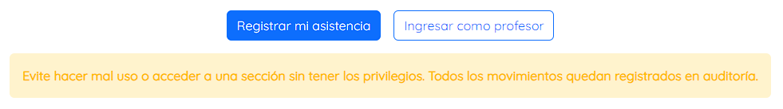
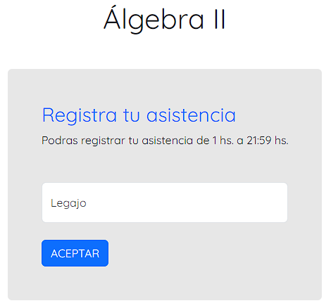
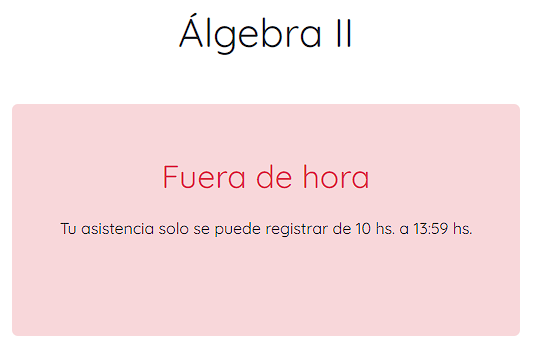
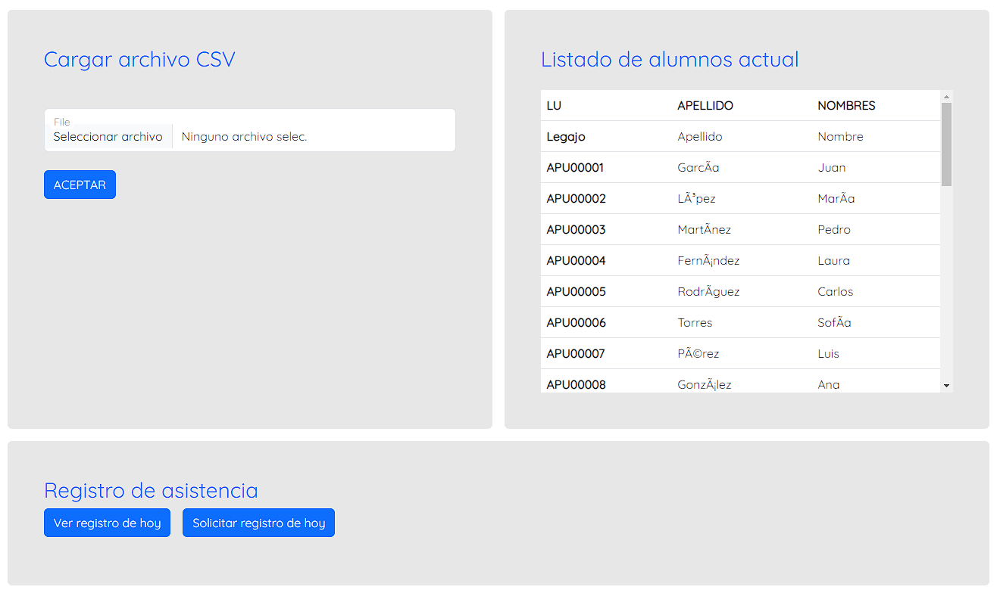

# Sistema de asistencia


## Descripción
Sistema de asistencia destinado a la gestión de asistencia de los alumnos a las clases de la universidad.

## Tecnologías
* Java 17
* Spring Boot
* HTML
* CSS
* Thymeleaf
* Bootstrap
* Maven

## Instalación
Para instalar el sistema de asistencia se debe clonar el repositorio y ejecutar el siguiente comando:
```
mvn install
```
El cual instalará las dependencias necesarias para el correcto funcionamiento del sistema.

## Ejecución
Para ejecutar el sistema se debe ejecutar el siguiente comando:
```
mvn spring-boot:run
```
El cual ejecutará el sistema en el puerto 8080.

## Uso
Para utilizar el sistema se debe acceder a la siguiente URL:
```
http://localhost:8080
```
La cual mostrará la página de inicio del sistema.


### Alumno
Como alumno podrás registrar tu asistencia a las clases de la universidad en el horario que se haya establecido.



Ejemplo de asistencia fuera del horario establecido.



### Profesor/administrador
Como profesor/administrador podrás gestionar el listado de alumnos y el registro de asistencia. Próximamente: los horarios de las clases.



El listado de alumnos se debe cargar como un archivo CSV con los campos **legajo**, **apellidos**, **nombres**.
Asimismo, el registro de asistencia se exporta como un archivo CSV con los campos **legajo**, **apellidos**, **nombres**, **fecha y hora**, **asistencia**.